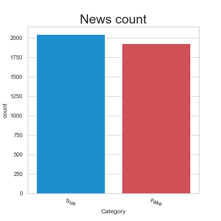
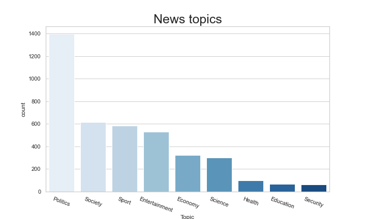
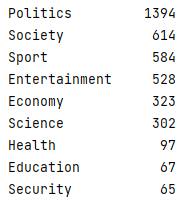
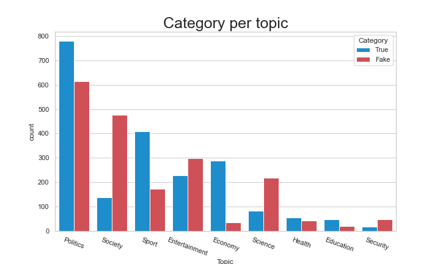
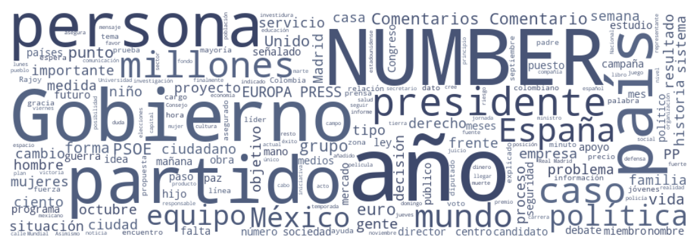
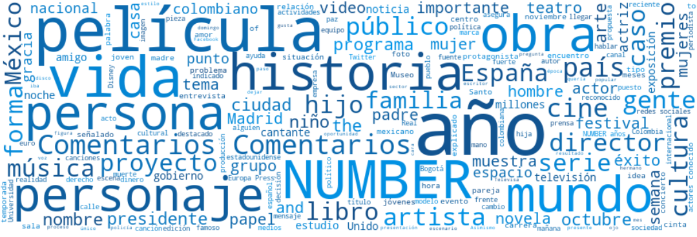

# Introducción a los datos

**Alumno:** Aguilera Luzania José Luis

## Información de los datos

#### Información general

Los datos son una recopilación de noticias extraidas de distintas fuentes por el usuario en Github [pipe11](https://github.com/pipe11/TFM_fake_news_detector),   
los datos contienen en total 3974 articulos en español, dividos en 2046 *Real News* y 1918 *Fake News*. Utilizando la estructua propuesta por [J.P. Posadas](https://github.com/jpposadas/FakeNewsCorpusSpanish).  
  
Las fuentes originales de los datos son:  
1. [jpposadas - FakeNewsCorpusSpanish](https://github.com/jpposadas/FakeNewsCorpusSpanish): 971 noticias.  
2. [several127 - FakeNewsCorpus](https://github.com/several27/FakeNewsCorpus): 9,408,908 articulos, la mayoría en inglés.  
3. [WebHouse Dataset](https://webz.io/free-datasets/spanish-news-articles/): 342,000 articulos en español.  
  
Para obtener el conjunto de datos final se requirió:  
1. Filtrar todas las noticias en español de la fuente 2.  
2. Clasificar la noticia según su tema.  
3. Clasificar las noticias como *Real* o *Fake* usando un clasificador basado en los datos de J.P. Posadas.

#### Temas de las noticias

El *corpus* cubre noticias de 9 temas diferentes.  

1. Ciencia.  
2. Deportes.  
3. Economía.  
4. Entretenimiento.  
5. Educación.  
6. Política.  
7. Salud.  
8. Seguridad.  
9. Sociedad

#### Estructura de los datos

- Id: Identificador de cada instancia.  
- Category: Categoría de la noticia (True o False).  
- Topic: Tema relacionado con la noticia.  
- Source: Nombre de la fuente.  
- Headline: Titulo de la noticia.  
- Text: Texto de la noticia    .  
- Link: URL de la fuente.

# Análisis de los datos

#### Noticias según la categoría

#### Noticias según el tema

#### Noticias según el tema y la categoría

## Word Cloud

#### Word Cloud de todas las noticias

#### Word Cloud de todas las noticias de entrenetimiento

#### Word Cloud de todas las noticias sobre salud

