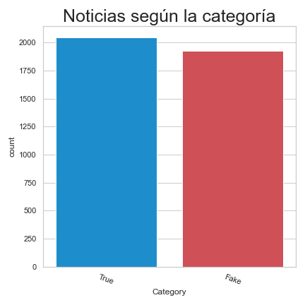
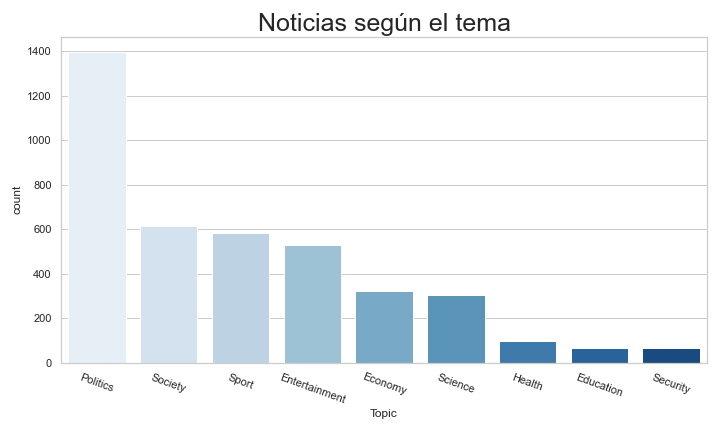
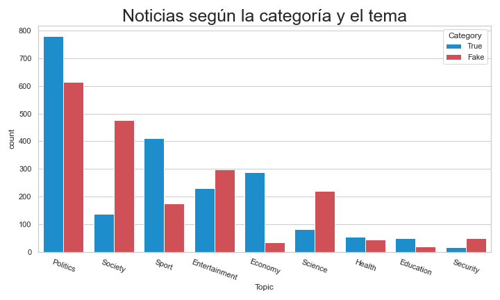
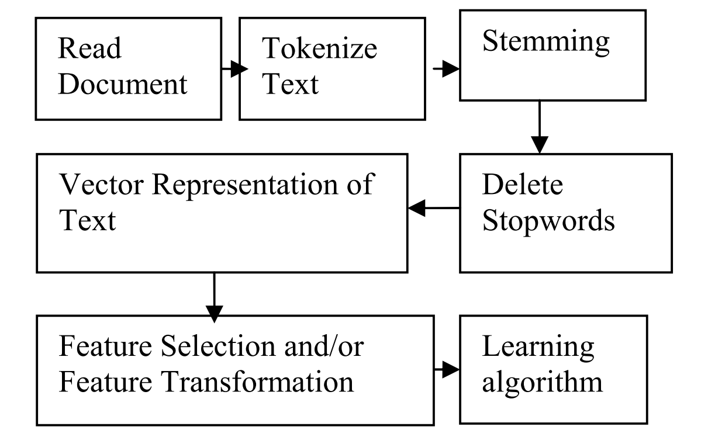
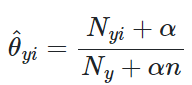
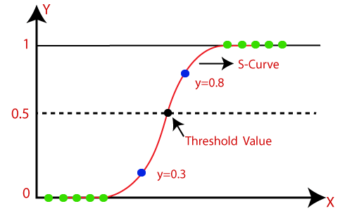
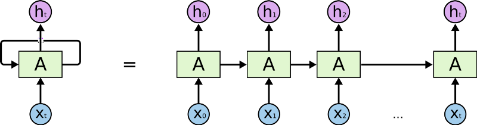
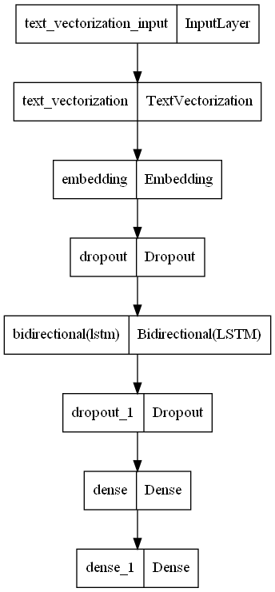
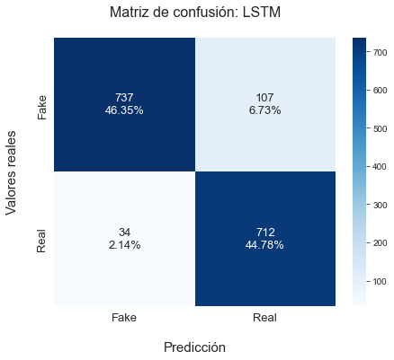

# 1. Introducción a los datos

**Alumnos**

- Aguilera Luzania José Luis
- Francisco Javier Castro Marquez

## Introducción

#### ¿Qué es la detección de *Fake News*?

La detección de *Fake News* (noticias falsas) es la tarea de evaluar la veracidad de las afirmaciones en las noticias. Este es un problema crítico en el Procesamiento del Lenguaje Natural (PLN) porque tanto en medios de noticias tradicionales como en medios digitales las *Fake News* generan un gran impacto social y político en cada individuo. Por ejemplo, la exposición a las *Fake News* puede generar actitudes de ineficacia, alienación y cinismo hacia ciertos candidatos políticos (Balmas, 2014).

## Información de los datos

Los datos son una recopilación de noticias extraídas de distintas fuentes por el usuario en Github [pipe11](https://github.com/pipe11/TFM_fake_news_detector),
los datos contienen en total 3974 artículos en español, distribuidos en 2046 *True News* y 1918 *Fake News*. Utilizando la estructura propuesta por [J.P. Posadas](https://github.com/jpposadas/FakeNewsCorpusSpanish).

Las fuentes originales de los datos son:
1. [jpposadas - FakeNewsCorpusSpanish](https://github.com/jpposadas/FakeNewsCorpusSpanish): 971 noticias.
2. [several127 - FakeNewsCorpus](https://github.com/several27/FakeNewsCorpus): 9,408,908 artículos, la mayoría en inglés.
3. [WebHouse Dataset](https://webz.io/free-datasets/spanish-news-articles/): 342,000 artículos en español.

Para obtener el conjunto de datos final se requirió:
1. Filtrar todas las noticias en español de la fuente 2.
2. Clasificar la noticia según su tema.
3. Clasificar las noticias como *True* o *Fake* usando un clasificador basado en los datos de J.P. Posadas.

#### Temas de las noticias

El *corpus* cubre noticias de 9 temas diferentes.

1. Ciencia.
2. Deportes.
3. Economía.
4. Entretenimiento.
5. Educación.
6. Política.
7. Salud.
8. Seguridad.
9. Sociedad

#### Estructura de los datos

- Id: Identificador de cada instancia.
- Category: Categoría de la noticia (True o False).
- Topic: Tema relacionado con la noticia.
- Source: Nombre de la fuente.
- Headline: Titulo de la noticia.
- Text: Texto de la noticia	.
- Link: URL de la fuente.

# 2. Análisis de los datos

#### ¿Qué es el análisis de los datos?

El análisis de los datos se utiliza para garantizar que los resultados producidos son válidos y aplicables a los objetivos deseados. Permite el identificar errores obvios, así como comprender mejor los datos y detectar valores atípicos.

#### Noticias por categorías

#### Cantidad de noticias según el tema

#### Cantidad de noticias según el tema y la categoría

## Word Cloud

#### ¿Qué es?

*Word Cloud* es una representación visual de las palabras que forman un texto, donde el tamaño es mayor para las palabras que aparecen con más frecuencia.

#### Palabras vacías o *stopwords* en español

Las *stopwords* o palabras vacías son aquellas que carecen de sentido de manera individual o sin una palabra clave o *keyword*. Algunos ejemplos son: el, la, ellos, ustedes, para, ser, etc.

Se utilizan las *stopwords* proporcionadas por la librería `nltk` en conjunto con las obtenidas del repositorio "stopwords-es" del usuario [genediazjr](https://github.com/stopwords-iso/stopwords-es)

#### Word Cloud de todas las noticias

#### Word Cloud de todas las noticias sobre entretenimiento

#### Word Cloud de todas las *real news* noticias sobre entretenimiento

#### Word Cloud de todas las *fake news* noticias sobre entretenimiento

#### Word Cloud de todas las noticias sobre salud

#### Word Cloud de todas las *real news* noticias sobre salud

#### Word Cloud de todas las *fake news* noticias sobre salud

# 3. Clasificación

#### Clasificación de texto

La clasificación de textos es la tarea de clasificar un documento en una categoría predefinida, es decir, si *d_j* es un documento del conjunto de documentos *D* y *{c_1, c_2, ..., c_n}* es el conjunto de categorías, entonces la clasificación de textos asigna una categoría *c_i* al documento *d_j*. El caso de la detección de noticias falsas se puede resolver como un problema de clasificación de textos, donde a cada noticia *n_i* del conjunto de noticias *N* le asignamos una categoría del conjunto *{true, fake}*.

El proceso de clasificación de textos se muestra en la siguiente figura:

#### Cargar el lematizador

La lematización consisten en que dada una forma flexionada (plural, femenino, conjugada, etc.) se halla el lema correspondiente. El lema es la forma que por convenio se acepta como representante de todas las formas flexionadas de una misma palabra. Por ejemplo: el lema de "diré", "dije" y "diríamos" es "decir". Utilizar los lemas permite conservar coherencia en el texto, mientras que se reduce su tamaño.

Para poder lematizar palabras en español se utiliza la librería spacy en conjunto con las reglas para lematización en español creadas por el usuario de github pablodms.

Para poder utilizar el lematizador es necesario ejecutar los siguientes comandos en la consola o en una celda de jupyter.

#### Procesamiento del texto

En el procesamiento requiere de dos funciones process_text y get_processed_corpus.

**Función: process_text**

Se encarga de procesar el texto realizando los siguientes pasos:

- Eliminar hipervínculos.
- Eliminar los saltos de línea.
- Cambiar las etiquetas de números, teléfonos, correos y urls por una en español.
- Eliminar todos los caracteres que no sean del español.
- Obtener los lemas de todas las palabras del texto.

**Función: get_processed_corpus**

Procesar las más de 3000 noticias que hay en el corpus no es una tarea que lleva su tiempo, para reducir el tiempo en el que se ejecuta la libreta y se realizan pruebas en los modelos se creó la función get_processed_corpus que procesar el corpus y guardarlo en un archivo para cargarlo después de modo que solo se procesa una vez y se puede utilizar cada vez que sea necesesario, en caso de querer procesarlo cada vez que se ejecute, solo es necesario eliminar el archivo processed_corpus_spanish.csv.

#### Vectorización y características TF-IDF

**Vectorización**

Consiste en convertir las palabras en los textos de las noticias en vectores numéricos que las representan.

**Term frequency - Inverse document frequency**

- Es una técnica que expresa que tan relevante es una palabra para un documento (texto).
- TF-IDF es el producto de dos medidas
  - Term Frequency: Mide el número de veces que un término (palabra) aparece en el documento. 
  - Inverse Document Frequency: Mide si el término es común o no, en el documento. 

**TF-IDF Vectorizer**

- Convierte una colección de documentos en una matriz de características TF-IDF, donde las columnas son los documentos y los renglones los términos, los valores de cada elemento son la importancia en dicho documento.
- Es el equivalente a utilizar CountVectorizer seguido de TfidfTransformer.
  - CountVectorizer: Convierte una colección de documentos en una matriz de conteo de tokens.
  - TfidfTransformer: Convierte una matriz de conteo en una matriz de características TF-IDF.

## Naive Bayes

Naive Bayes es uno de los modelos más simples y usados en clasificación de texto porque sus resultados son tan buenos como otros modelos más sofisticados.

Se basa en la aplicación del teorema de Bayes para predecir la probabilidad de que un documento pertenezca a una clase *P(c_i|d_j)* a partir de la probabilidad de los documentos dada la clase *P(d_j|c_i)* y la probabilidad a priori de la clase en el conjunto de entrenamiento *P(c_i)*.

 

MultinomialNB implementa el algoritmo de Naive Bayes para datos distribuidos multinomialmente, y es una de las dos variantes clásicas de Naive Bayes  utilizadas en la clasificación de textos (donde los datos se representan normalmente como recuentos de vectores de palabras, aunque también se sabe que los vectores tf-idf funcionan bien en la práctica). La distribución está parametrizada por vectores *theta_y = (theta_y_1, ..., theta_y_n)* para cada clase *y*, donde *n* es el número de características (en la clasificación de textos, el tamaño del vocabulario) y *theta_y_i* es la probabilidad *P(x_i | y)* de que el rasgo *i* aparezca en una muestra perteneciente a la clase *y*.

Los parámetros *theta_y* se estiman mediante una versión suavizada de máxima verosimilitud, es decir, el recuento de la frecuencia relativa:

 

donde

 

es el número de veces que la característica *i* aparece en una muestra de la clase *y* en el conjunto de entrenamiento *T*, y

 

es el recuento total de todas las características para la clase *y*.

Los priores de suavizado *alpha >= 0* tienen en cuenta las características que no están presentes en las muestras de aprendizaje y evitan las probabilidades nulas en los cálculos posteriores. Establecer *alpha = 1* se llama suavizado de Laplace, mientras que *alpha < 1* se llama suavizado de Lidstone.

## Regresión logística

La regresión logística es un modelo matemático empleado en estadística para predecir qué tan probable es que ocurra un evento teniendo en cuenta datos previos. Esta funciona con datos binarios, es decir, cuando un evento ocurre o no ocurre.

La función logística está dada por:

 

Como se observa en la gráfica, *S-Curve* representa una relación no lineal entre *X* e *Y*. *S* significa sigmoide, ya que la logística es una función sigmoide, la cual se representa de la siguiente manera:

 

En la gráfica se cuenta con un *Threshold Value* de 0.5, lo que significa que si la predicción del modelo da un valor mayor a 0.5 lo contara como verdadero (**1**) y si el valor es menor a 0.5 se contará como falso (**0**).

## LSTM (Long Short-Term Memory)

**RNN**

En las redes neuronales tradicionales las entradas y las salidas son independientes unas de otras, pero en caso en los que se requiera predecir la siguiente palabra de una sentencia, se requiere conocer la palabra anterior o varias palabras anteriores; el intentar predecir el final de una película será más o menos acertado dependiendo de la información previa.

Las RNN son redes con ciclos en ellas, permitiendo que la información persista. Las RNN no son muy diferentes a las redes tradicionales, se puede entender como múltiples copias de una red, cada una pasando un valor a la siguiente como se muestra en la imagen:

 

Las RNN recuerdan información a través del tiempo. Es útil cuando se quiere predecir dada una secuencia de información, las redes que pueden recordar la información a largo plazo son llamadas LSTM (Long Short-Term Memory) o Memoria a Largo Plazo.

**Bi-LSTM**

Las redes bidireccionales son en realidad dos redes RNN LSTM juntas. Esta estructura permite obtener la información hacia adelante y hacia atrás. Utilizando redes bidireccionales la entrada se ejecuta en dos direcciones, una del pasado al futuro y otra del futuro al pasado preservando información de ambos puntos en el tiempo de la secuencia, pasado y futuro.

 

#### Estructura de nuestro modelo

 

## Resultados

 

 

 

